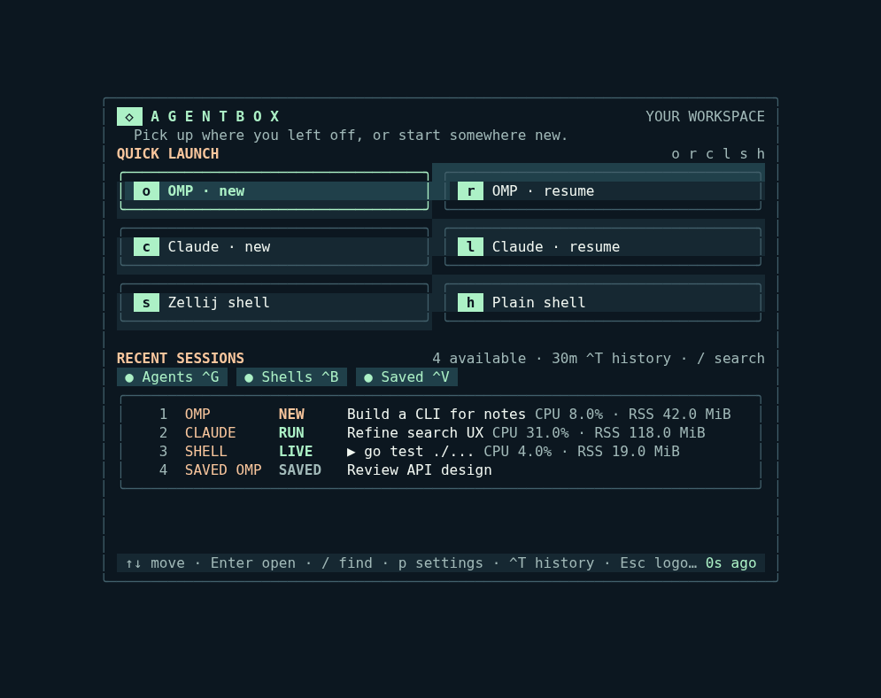
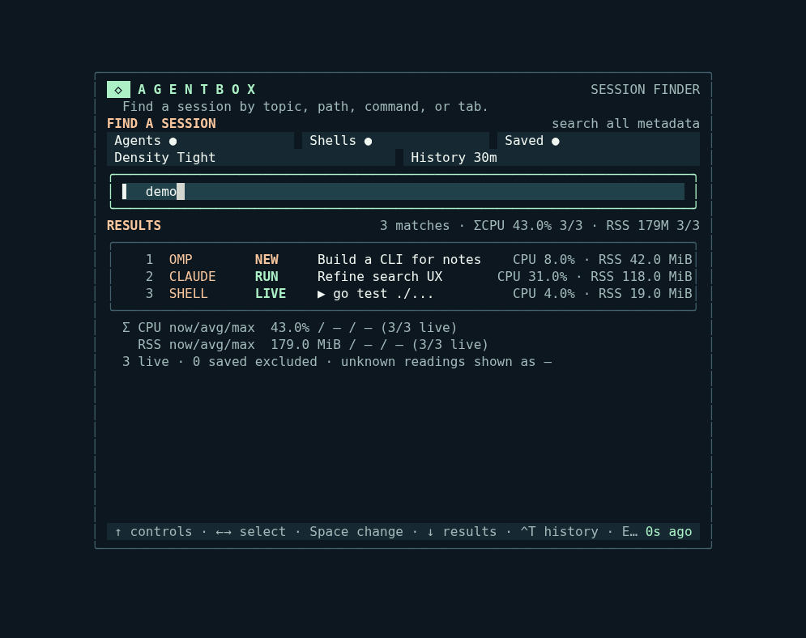

# Agentbox Login

A keyboard- and mouse-friendly terminal workspace for hopping between [Zellij](https://zellij.dev/) sessions over SSH. Start or resume [omp](https://github.com/can1357/oh-my-pi) and Claude Code, open a shell, search sessions, and see live CPU/RSS without losing your place when you detach.

The dashboard is a Go [Bubble Tea](https://github.com/charmbracelet/bubbletea) app, **not** an SSH server. Your existing SSH authentication and shell stay in charge; a failed launcher can fall through to a normal shell.



<details>
<summary>Search and filter sessions</summary>



</details>

*Screenshots are rendered from synthetic session data, not a real machine's processes, paths, or history.*

## What it does

- Launch new or resume recent omp/Claude Code sessions; create Zellij shells or drop into a plain shell. Rejoin live sessions and resurrect saved Zellij layouts.
- Search across session names, topics, pane directories, commands, and tabs. Filter agents, shells, and saved sessions; choose Compact, Tight, or Spacious density.
- Show best-effort agent states (`RUN`, `READY`, `ASK`, `NEW`) and current/historical CPU and RSS, including aggregate usage and charts in the search view. Status is inferred from pane contents, **not** an authoritative task state.
- Open immediately from a local snapshot; update session metadata asynchronously. The optional background refresh keeps the Zellij finder warm between dashboard launches.
- Keep preferences and snapshots under `~/.local/state/agentbox-login/` on the host. Nothing is sent to a service.

## Requirements

Linux (the metrics collector uses `/proc`), Go 1.26 (pinned in `mise.toml`), Zellij on `PATH`, and an interactive terminal. Install omp or Claude Code only if you want their launch actions; `sqlite3` is optional for stored omp session titles. The launcher starts sessions from `~/code`, so create that directory or adjust `cmd.Dir` in `backend.go` for your setup. Zellij's layout-resurrection and pane-listing commands must be available in your installed version.

## Build and try it

```sh
git clone https://github.com/sebafudi/agentbox-login.git
cd agentbox-login
mise install                       # or use an existing Go 1.26 installation
mkdir -p ~/.local/bin ~/code
go build -p 2 -o ~/.local/bin/agentbox-login .
~/.local/bin/agentbox-login
```

Use `/` to search, `p` for preferences, or `h` to exit to a plain shell. Esc on the home screen requests logout (exit status 2). For a warm cache outside the UI, run `agentbox-login --refresh` periodically with your user timer or scheduler; if Zellij is unavailable it exits with an error and retains the previous snapshot.

To start it for **interactive SSH Bash** sessions, add this to `~/.bashrc` after your normal interactive-shell guard:

```bash
if [[ -n $SSH_CONNECTION && -z $ZELLIJ && -z $NO_ZELLIJ && -t 0 && -t 1 && $TERM != dumb ]]; then
  agentbox-login
  case $? in 2) exit 0 ;; esac
fi
```

Put `~/.local/bin` on `PATH`. This does not change `sshd`; missing/crashed binaries fall back to Bash. To bypass the dashboard for one connection, set `NO_ZELLIJ=1` in the remote shell environment. Don't launch it for noninteractive SSH commands.

Inside Zellij, `agentbox-login --find-agent` opens a search-only picker; selecting a result switches sessions. The `Ctrl-B`, `Ctrl-F` binding shown below is **optional user configuration**, not installed by this repository. In your Zellij `keybinds { normal { … } }` section:

```kdl
bind "Ctrl f" {
    Run "/home/YOU/.local/bin/agentbox-login" "--find-agent" {
        floating true
        close_on_exit true
        name "find sessions"
    };
    SwitchToMode "Locked";
}
```

Replace `/home/YOU` with your home directory. If your Zellij prefix is `Ctrl-B`, press `Ctrl-B`, then `Ctrl-F`.

## Keys

| View | Controls |
| --- | --- |
| Home | `o`/`r` new/recent omp; `c`/`l` new/recent Claude Code; `s` Zellij shell; `h` plain shell; `1`–`9`/`0` recent row; arrows + Enter select; `/` or `f` search; `p` preferences; Esc logout. |
| Search / picker | Type to filter; Up or Tab from the query focuses inline settings, Left/Right picks a setting, Enter/Space changes it, Down returns to query/results, Enter opens a result, Esc returns/closes. |
| Anywhere in dashboard | Ctrl-G/B/V toggle agents/shells/saved; Ctrl-T cycles history from 5 minutes to 24 hours. Preferences persist across the dashboard and picker. |
| Mouse | Click launch cards and filters; click a session to focus, click again to open; scroll over rows. |

Saved sessions appear after live sessions; session states, foreground commands, and `/proc` metrics are best-effort observations. Missing samples are omitted rather than reported as zero. Historical combined maxima come from simultaneous samples, not sums of individual peaks. A snapshot may include local session names, directories, and commands: **do not publish `~/.local/state/agentbox-login/`**.

## Machine inventory companion

`go build -p 2 -o ~/.local/bin/agentbox-facts ./cmd/agentbox-facts` builds a separate, machine-specific inventory collector used on the original agentbox. It queries local systemd, Docker, Zellij, networking, Tailscale, Cloudflare, and projects and writes a Markdown snapshot to `~/.omp/agent/machine-state.md` (override with `AGENTBOX_FACTS_OUT`). It is **not required** for the workspace. Its output can contain private network, host, and project details: never commit or share a generated snapshot. Adapt the collector to your host before using it.

## Development

```sh
go test -p 2 ./...
```

Built with Bubble Tea v2, Lip Gloss v2, Bubbles v2, BubbleZone v2, and ntcharts v2. The workspace is tailored to Linux/Zellij and the original host's omp/Claude workflow; it is not a general-purpose SSH gateway.
