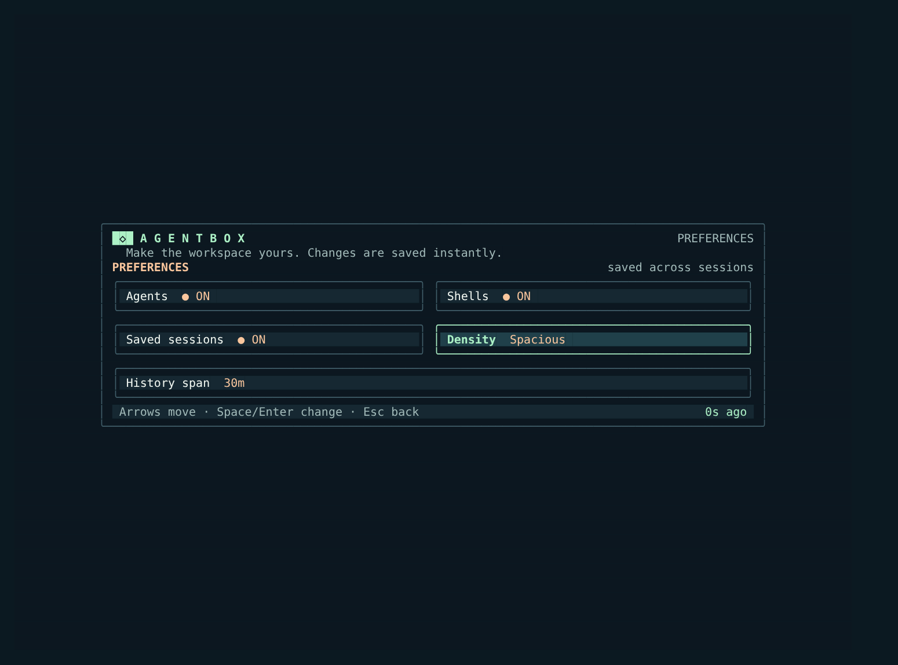
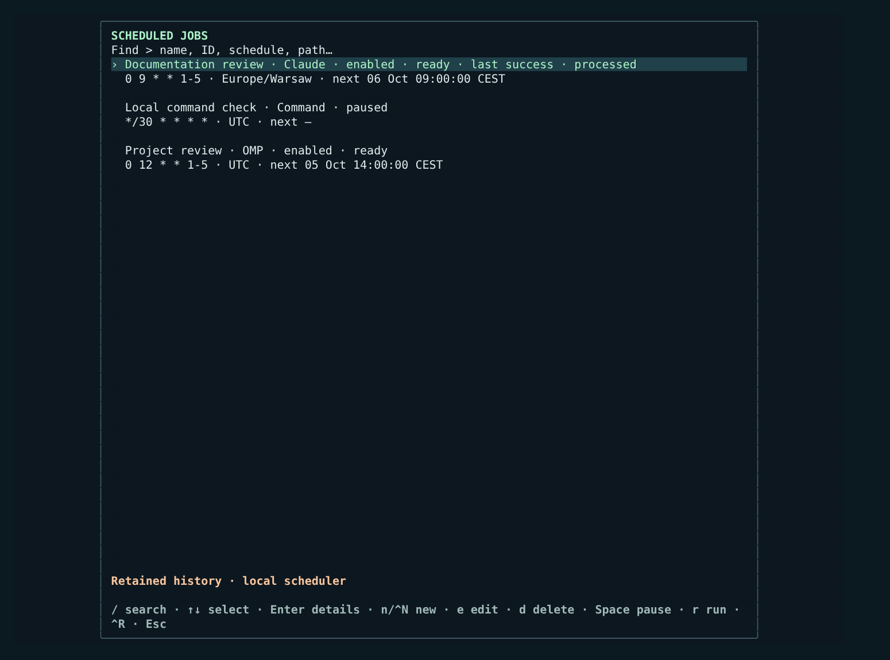
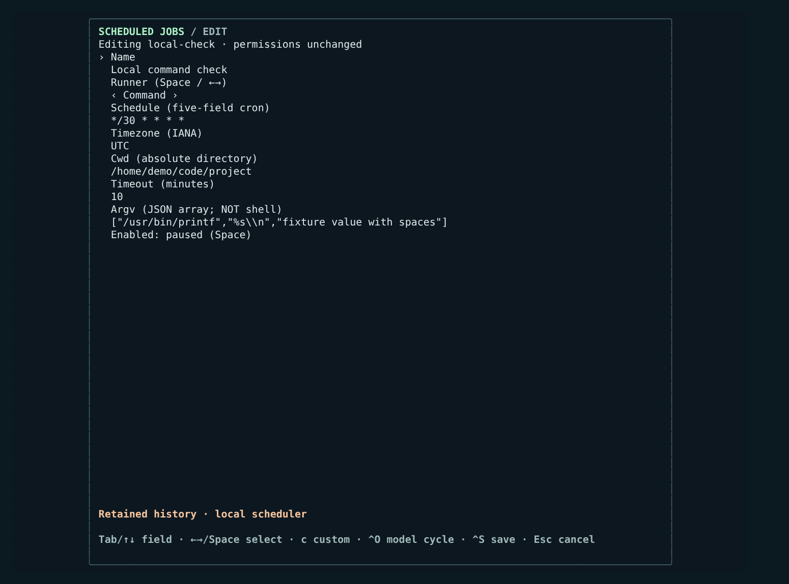

# Agentbox Login

A terminal home screen for SSH + Zellij: start coding agents, jump between sessions, search by topic or command, watch CPU/RSS, and manage scheduled jobs. Built with Go and Bubble Tea; **not** a replacement SSH server.

### Workspace · start or rejoin


### Search · sessions and resource history


### Preferences · filters, density, history span



### Scheduled jobs · schedules and retained run history



### Job editor · runner-specific configuration



*All five screenshots use synthetic sessions, jobs and configuration in Spacious density at 120 × 44 terminal cells. No live machine data is pictured.*

## Get started

Requires Linux (`/proc` for metrics), Go 1.26, and [Zellij](https://zellij.dev/). [omp](https://github.com/can1357/oh-my-pi) and Claude Code are optional; their launch actions need the corresponding commands on `PATH`. The launcher starts new sessions in `~/code`.

```sh
git clone https://github.com/sebafudi/agentbox-login.git
cd agentbox-login
mise install                  # or provide Go 1.26 yourself
mkdir -p ~/.local/bin ~/code
go build -p 2 -o ~/.local/bin/agentbox-login .
~/.local/bin/agentbox-login
```

`/` searches; `p` opens preferences; `o/r` and `c/l` start/resume omp and Claude; `s` creates a Zellij shell; `h` exits to Bash. **a** or **Ctrl-J** opens scheduled jobs. Arrows + Enter or mouse clicks open sessions. Ctrl-G/B/V toggle agents/shells/saved; Ctrl-T cycles the history window. Esc on the home screen requests logout (exit code 2). Settings persist under `~/.local/state/agentbox-login/`.

Preferences control Agents, Shells, Saved, Density and History. Saved sessions must also match their Agents/Shells category; all filters may be off. Density cycles **Compact → Tight → Spacious**, with narrow-terminal fallback. History cycles **5m → 15m → 30m → 1h → 6h → 12h → 24h** (default 30m). Search exposes these same five controls above the query: Up/Tab from the query focuses them, Left/Right selects a control, Enter/Space changes it, and Down returns to the query/results. Preferences persist immediately in `~/.local/state/agentbox-login/preferences`.

To launch on interactive SSH Bash logins, add this to `~/.bashrc` (with `~/.local/bin` on `PATH`):

```bash
if [[ -n $SSH_CONNECTION && -z $ZELLIJ && -z $NO_ZELLIJ && -t 0 && -t 1 && $TERM != dumb ]]; then
  agentbox-login
  case $? in 2) exit 0 ;; esac
fi
```

This leaves `sshd` alone. If the binary fails, Bash remains available; set `NO_ZELLIJ=1` to bypass the workspace. `agentbox-login --refresh` can run periodically to keep the session cache warm; `agentbox-login --find-agent` opens the search-only picker inside Zellij. To bind the picker to `Ctrl-B`, `Ctrl-F`, add this to Zellij's `keybinds { normal { ... } }` block (replace `YOU`):

```kdl
bind "Ctrl f" {
    Run "/home/YOU/.local/bin/agentbox-login" "--find-agent" {
        floating true
        close_on_exit true
        name "find sessions"
    };
    SwitchToMode "Locked";
}
```

Session state and foreground command detection are best-effort; CPU/RSS history is sampled from `/proc`. Snapshots can contain session names, paths and commands: **never publish `~/.local/state/agentbox-login/`**.

`cmd/agentbox-facts` is a separate, host-specific inventory collector, **not required** for the workspace. Its generated Markdown may include private machine/network details; do not commit it. Build it with `go build -p 2 -o ~/.local/bin/agentbox-facts ./cmd/agentbox-facts` only if you want to adapt it for your host.

## Scheduled jobs

Optional integration with the local `agent-scheduler` service and `scheduler` CLI. Open from home with **a/Ctrl-J**, from the session finder with **Ctrl-J**, or directly with `agentbox-login --scheduled-jobs`. Configuration and logs travel through the private Unix HTTP socket: `SCHEDULER_SOCKET`, otherwise `$XDG_RUNTIME_DIR/agent-scheduler.sock` (with `/run/user/<uid>` fallback). The launcher never reads or writes scheduler `state.json`; service errors are visible and requests run asynchronously with a five-second deadline.

### Browse and operate

Search matches names, IDs, schedules, timezones, runners and working directories, **not prompt or argv content**. Lists and configuration previews hide those values; opening the editor explicitly reveals them. Details show schedule/timezone, next run, enabled/paused and running state, last result/duration, and success/failure/running counts for **retained history**, not lifetime totals.

| Where | Key | Action |
|---|---|---|
| Search query | Down / Tab / Enter | Focus job results |
| Results / details | ↑↓ or j/k | Select a job / retained run |
| Results | Enter | Open job details and history |
| Results / details | n / Ctrl-N | Create a job; Ctrl-N also works in the query |
| Results / details | e | Edit the selected job |
| Results / details | Space | Enable or pause the selected job |
| Results / details | r | Start a manual run, even when paused |
| Results / details | d | Open irreversible deletion confirmation |
| Details | Enter / l | View the selected run's log |
| Details / log | m | Monitor, view logs or resume the selected run |
| Details / log | x | Stop the selected run if active |
| Jobs / details / log | Ctrl-R | Refresh configuration/history or the open log |
| Any scheduled view | Esc | Return one level; cancel an editor or confirmation |

Pausing prevents future scheduled runs but does not stop an active process. A manual run does not enable a paused job. Deletion names the job and warns that its retained history and logs will be removed: only **y/Enter** confirms; **Esc/n** cancels. The service refuses deletion of running jobs or jobs with an open interactive continuation, keeping the confirmation open with the error.

### Create or edit safely

New jobs default to **Command**, **paused**, `0 9 * * *`, `UTC`, the launcher's current directory and a **30-minute timeout**. Name, ID and runnable argv still need filling in; creation does not automatically start work. Leave Enabled paused until you have reviewed the configuration and intended effects.

Field order is **ID (creation only), Name, Runner, Schedule, Timezone, Cwd, Timeout, Argv (command) or Prompt + Model (agents), Enabled**. **Tab/Shift-Tab**, **Up/Down** or **Enter** move between fields; **Ctrl-S** saves and **Esc** discards the draft. **Space** toggles Enabled when that field is focused.

The runner selector cycles with **Left/Right/Space** through **Command → OMP → Claude → Claude SDK** (API values `command`, `omp`, `claude-print`, `claude-sdk`). Commands have no prompt/model control. Argv must be a nonempty **JSON array of strings**, for example:

```json
["/usr/bin/printf", "%s\n", "two words", ""]
```

The executable is the first argument and must be nonblank. Spaces, empty arguments after the executable, and shell metacharacters stay **literal arguments**: no implicit shell, interpolation or splitting. Non-string arguments and NUL are rejected. Do not put credentials in argv or prompts.

Agent runners require a prompt. The model selector offers the runner's default (empty model) and custom IDs:

- **OMP:** the installed `omp models --json` catalog, loaded asynchronously once per launcher session without starting inference. If unavailable, default/custom remain usable and the error is shown.
- **Claude / Claude SDK:** aliases `opus`, `sonnet`, `fable` and explicit choices `claude-opus-5-5`, `claude-sonnet-5-5`, `claude-fable-5-1`, `claude-haiku-4-5-20251001`.

**Left/Right/Space** cycle model choices; **c** enters custom text and **Ctrl-O** cycles even from custom entry. Existing custom IDs remain intact. Each runner keeps its own model draft; the first switch to another agent runner selects its default instead of carrying an OMP ID into Claude. Switching runners preserves prompt/argv drafts and custom model text when cycling away and back.

Creation sends the active runner's configuration to `POST /jobs`. Editing sends `POST /jobs/patch` with `{id,changes}` containing **only changed active fields**, rather than overwriting the job from a stale snapshot. ID is immutable; untouched fields, including concurrent changes, inactive argv/prompt/model, permission mode, tool allowlists and additional directories are preserved. Switching agent runners uses the target model draft, sending an empty model when needed to select its default. The editor does not grant bypass permissions; new jobs use server permission defaults.

Local validation, server rejection and transport/unavailable-service errors **keep the editor and its drafts open**, including on narrow terminals. The service validates the merged configuration atomically, including full five-field cron syntax, IANA timezone and an existing absolute working directory. Timeout must be **1–1440 whole minutes**.

### Inspect a specific run

Select a retained run in details before opening its log, monitoring/resuming it or stopping it. **Enter/l** opens the TUI log; **m** behaves according to that exact run:

- **Active agent:** opens a read-only monitor through `scheduler join <run-id>`; it does not attach an interactive writer to the automated process.
- **Completed agent:** resumes its exact persisted omp/Claude session in the original cwd under the scheduler's per-run writer lock. Missing/invalid session metadata produces an explicit error, never a fallback to an unrelated last session.
- **Ordinary command:** opens the selected TUI log, not an agent session.
- **Recognized Payments nightly command wrapper:** uses service-validated saved Claude metadata to monitor an active run read-only or resume the completed run's exact conversation. Interrupted or discarded conversations may be reopened manually without changing their recorded workflow outcome.

Existing live monitor/resume Zellij sessions are reused; exited layouts are not resurrected. Log headers include coarse status, reported outcome (`idle`, `skipped`, `processed`, `success`, `failure`, `timeout`, `cancelled`, `interrupted`), exit code, duration and reason. Untrusted logs are stripped of terminal control sequences before display.

Logs scroll with **↑↓/PgUp/PgDn**; **Home/End** moves to start/tail. In details, **PgUp/PgDn** scrolls the configuration while arrows select runs. Configuration/history and open logs refresh periodically; **Ctrl-R** requests an immediate refresh. **Esc** returns through log/details/jobs to the original home or finder, preserving the underlying session finder and its preferences.

Tests: `go test -p 2 ./...`.
